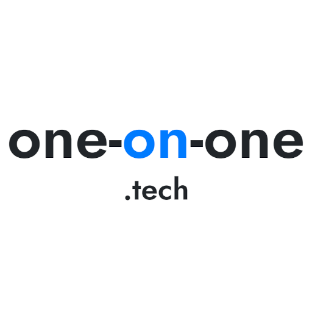
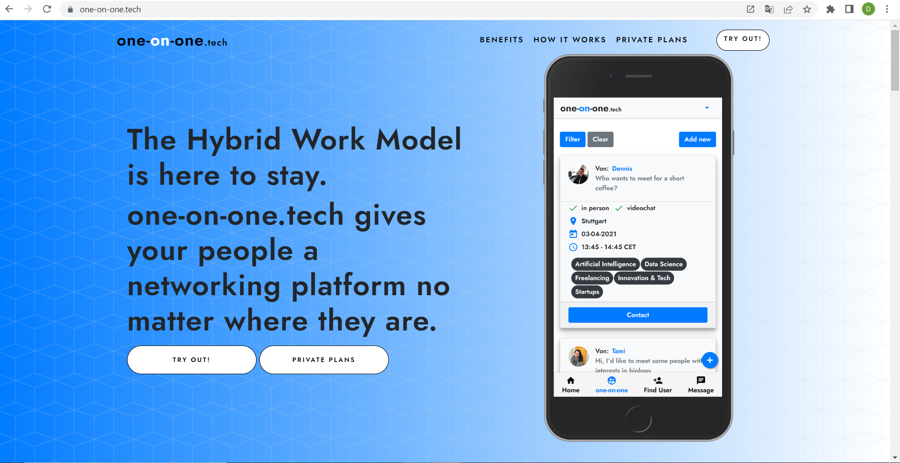
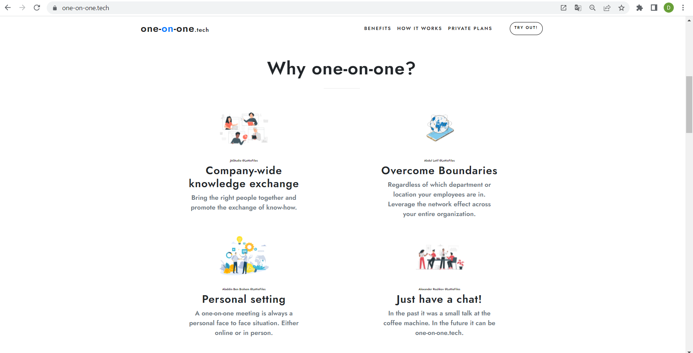
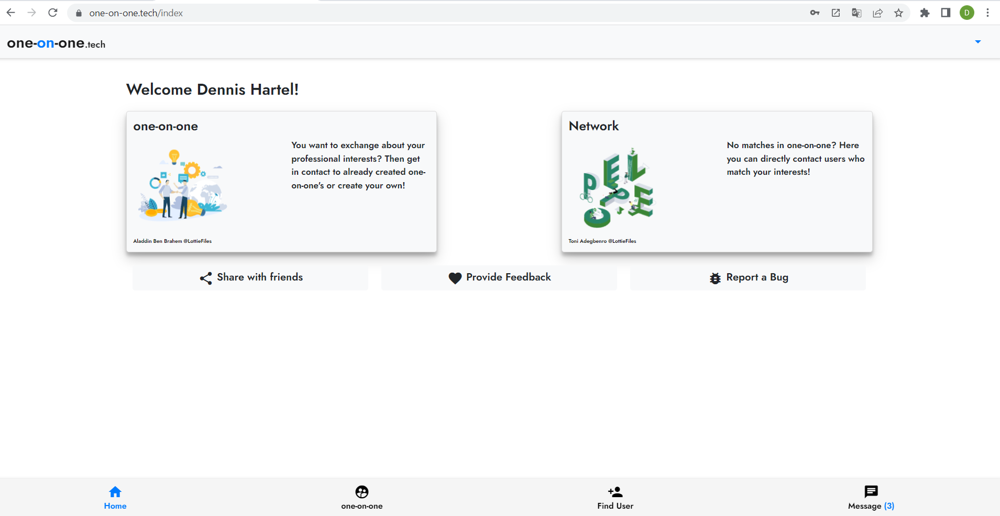
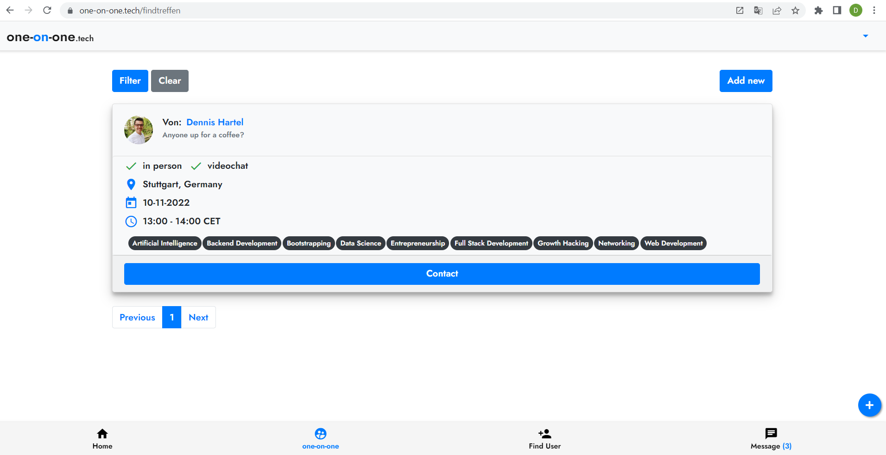
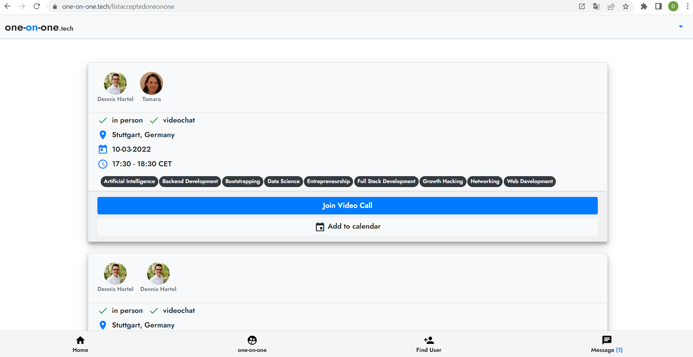

[one-on-one.tech](https://one-on-one.tech/) is one of my side project. It’s a website which helps professionals to improve business networking by having one-on-one meetings with other professionals who match their interests.

:warning: Currently I am not willing to share the code. This repository should show what the project is, how I approached to problem and give some insights into the technical development

:warning: The project is abandoned and not live anymore from November 2022.

# How it started
At the beginning of 2020 during the start of covid I had some free time as our company was closed for 2 weeks. I used the time to deepen my skills in Django & Frontend Development. At the end of the Udemy course there was a capstone project. Only following this project was a bit boring to me so I started my own project. 

# Problem:
I hate the traditional way of networking and I bet many of you too. Too often I found myself in networking situations with other people but couldn't get much value out of it. After thinking about it for quite some time I ended up with 3 reasons:
Lack of common interests: Working as a technical person in a business department I usually have a counterpart who has completely different interests than me. Even though it is still nice to learn about other topics I couldn’t expand my network with people where I could benefit from (and the other way around).
Approaching people can be awkward: This counts for real life situations as well for online situations. Do people actively network via Linkedin?
Networking in groups: Often when I was in a networking situation, I was in a medium sized group of people with extremely unpersonal conversations. 

# Solution:
I actually started this project as a capstone project for learning purposes after a django course with no intention to build a real product. That's the way it is when you are bored during the pandemic so one year later I have the first working product ready which aims to solve the problems stated above. 
My website allows you to create so called “one-on-one” meetings. These one-on-ones are always related to specific topics so people get to meet like minded counterparts. Other users can then reach out to the one-on-one creator in order to organize a conversation like a virtual/ real coffee. No AI involved which creates matches for you. You decide.
My main goal is to bring together the right people and raise the quality of networking.

# Technical Implementation:

I use Django as my Backend with a PostgreSQL hosted on Heroku. On the Frontend I use HTML, CSS and Javascript (Vanilla & Jquery). I implemented a very basic Service Worker in order to provide a PWA.

# Future:
After investing quite some time in this project I want to validate this idea in public in order to get feedback. My actual goal is to implement this in larger companies for networking between employees. I feel like there is great potential for this as the networking possibilities in large enterprises are very poor (Please challenge me on this assumption).

# Demo
Demo Video: https://www.dropbox.com/s/erzdsdt14fdks1z/VID_20221030_140113.mp4?dl=0

